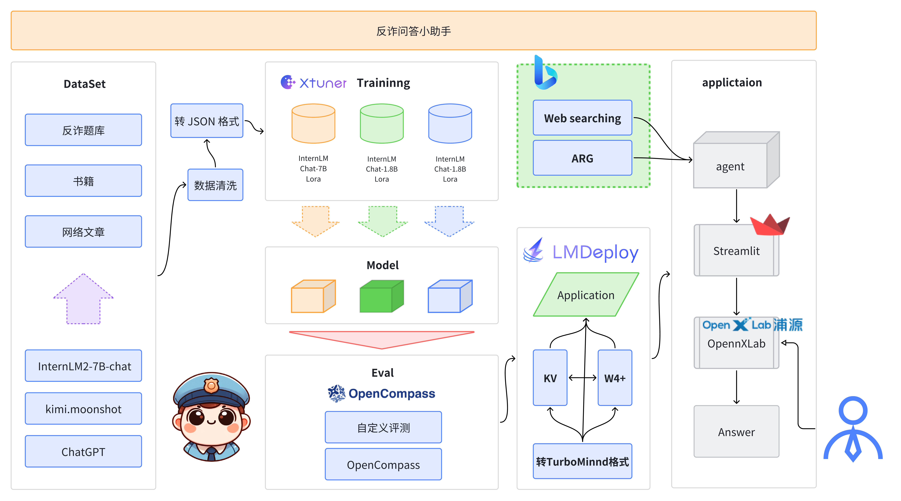

<div align="center">

  <div align="center">
    <b><font size="5">Chat-反诈</font></b>
</div>

[![license][license-image]][license-url]
[![evaluation][evaluation-image]][evaluation-url]

## Chat-反诈模型

[OpenXLab](https://openxlab.org.cn/models/detail/Eric-sc/Fanzha1_8B/tree/main) |  [ModelScope](https://www.modelscope.cn/models/EricSC/Fanzha1_8B) | [Github](https://github.com/bobspec/chat-ai-anti-fraud.git)

[license-image]: ./image/license.svg
[evaluation-image]: ./image/compass_support.svg
[license-url]: ./LICENSE
[evaluation-url]: https://github.com/internLM/OpenCompass/
</div>

## 📝目录

- Chat-反诈
  - [📝目录](#目录)
  - [📖 简介](#简介)
  - [🔗 模型及体验地址](#模型及体验地址)
  - [🚀 News](#-news)
  - [🧾 数据集](#数据集)
  - [🛠️ 使用方法](#使用方法)
    - [快速开始](#快速开始)
    - [重新训练](#重新训练)
      - [环境搭建](#环境搭建)
      - [XTuner微调](#XTuner微调)
    - [部署](#部署)
    - [测评与量化](#测评与量化)
      - [OpneCompass 评测](#OpenCompass评测)
  - [💕 致谢](#致谢)
    - [项目成员](#项目成员)
    - [特别感谢](#特别感谢)

## 简介
Chat-反诈模型是利用反诈相关的数据集进行模型训练的语言模型，基于 InternLM2 进行 LoRA 微调得到的诈骗信息识别及分析的语言模型。
反诈模型的开发源于我们观察到遭受到诈骗的人群越来越趋向于青少年，而诈骗手段层出不穷，很多人因缺乏防范意识和应对技巧，轻易成为诈骗分子的目标，蒙受巨大的财产损失和精神伤害。尽管社会各界不断加强反诈提示和宣传，帮助人们提高警惕，但依然有大量人群未能及时辨别出诈骗陷阱。

我们决定利用人工智能技术，开发一个智能反诈助手。反诈模型通过学习大量的诈骗案例和对话数据，能够在用户与潜在诈骗者的对话中实时提供预警和建议，帮助用户迅速识别和应对诈骗行为。我们的目标是将这些智能防范手段普及到更多人群，尤其是那些不太了解网络安全的用户，从而有效减少诈骗事件的发生。

通过反诈模型的广泛应用，弥补反诈宣传中的不足之处，为每一位用户提供24小时不间断的智能防护系统。这个模型不仅是对现有反诈措施的有力补充，更是利用科技手段提升社会整体安全水平的创新尝试。通过持续优化和推广这一模型，我们坚信能够为构建一个更安全、更安心的社会贡献一份力量。
本项目实现了一个基于反诈数据集的个性化 AI 微调大模型完整流程，帮助用户识别和应对各种网络诈骗手段。通过分析各种诈骗案例和用户的聊天记录，Chat-反诈模型能够在用户与潜在诈骗者的对话中实时提供预警和建议。

具体如何实现全流程的反诈 AI 微调，可参考主仓库-[chat-ai-anti-fraud](https://github.com/bobspec/chat-ai-anti-fraud.git)。
如何学习大模型部署和微调请参考：[开源大模型食用指南](https://github.com/datawhalechina/self-llm) 以及 [书生·浦语大模型实战营课程](https://github.com/InternLM/tutorial)

Chat反诈模型全流程如图所示：



## 模型及体验地址

### 体验地址：

### Chat-反诈模型 下载地址：

#### OpenXLab
1.8B:[OpenXLab](https://openxlab.org.cn/models/detail/Eric-sc/Fanzha1_8B/tree/main) 

#### ModelScope
1.8B: [ModelScope](https://www.modelscope.cn/models/EricSC/Fanzha1_8B)

## 🚀 News

***2024年6月21日，完成 [InternLM2-chat-1_8B模型的微调](https://openxlab.org.cn/models/detail/Eric-sc/Fanzha1_8B/tree/main)***

## 数据集

Chat-反诈模型 数据集采用各种网络诈骗案例和用户的聊天记录，共计 3000 余条,位于datasets文件夹下.数据集样例：
```
{
        "conversation": [
            {
                "input": "我接到了一个自称是电信公司的电话，告诉我我的电话费欠费，要求我立即通过他们提供的链接进行支付，否则会有滞纳金并且停机。我按照他们的指示进行了操作，后来发现电话费并没有欠费，这是不是诈骗？",
                "output": "这种情况属于典型的电信诈骗。骗子通常会冒充电信公司，声称你欠费，提供一个虚假的链接或电话号码让你支付所谓的欠款。判断这类诈骗的关键点包括：1. 自称是官方的电话，但要求你通过非官方渠道支付费用；2. 提供紧急的时间限制，制造紧迫感；3. 要求提供个人信息或支付信息。遇到这种情况，应立即挂断电话，通过官方渠道核实信息，避免通过陌生链接或电话进行支付。"
            }
        ]
    },
    {
        "conversation": [
            {
                "input": "我收到了一条短信，说我的快递丢失了，需要我点击一个链接进行赔偿申请。我点击链接并填写了个人信息，后来发现快递并没有丢失，这是不是诈骗？",
                "output": "这种情况属于典型的快递诈骗。骗子通过发送虚假的快递丢失短信，引导你点击钓鱼链接并填写个人信息。判断这类诈骗的关键点包括：1. 未通过官方渠道通知快递问题；2. 提供的链接为非官方链接；3. 要求填写个人信息或支付费用。遇到这种情况，应立即联系快递公司官方客服确认情况，避免通过陌生链接操作。"
            }
        ]
    }
```


## 使用方法
### 快速开始
#### 1、下载模型

#### 安装modelscope库
```
pip install modelscope
```

#### 模型下载
```
# 设置日志级别
from modelscope.hub.snapshot_download import snapshot_download
logging.basicConfig(level=logging.DEBUG)
try:
    logging.debug("Starting model download...")
    model_dir = snapshot_download('EricSC/Fanzha1_8B', revision='v1.0.0')
    logging.debug(f"Model downloaded to {model_dir}")
except Exception as e:
    logging.error(f"Error during model download: {e}")
    st.error(f"Error during model download: {e}")
    model_dir = None
```
#### 本地部署
```
git clone https://github.com/bobspec/chat-ai-anti-fraud.git
python start.py
```

### 重新训练

#### 环境搭建
##### clone 本项目
```
git clone https://github.com/xiangboit/chat-ai-anti-fraud.git
cd chat-ai-anti-fraud
```
##### 创建环境
```
pip install -r requirements.txt
cd train/
```
##### 下载模型
```
python model_download.py
```
##### XTuner微调
相关路径因服务器不同请自行变更路径，
使用 XTuner 进行微调，具体脚本可参考internlm2_chat_7b_qlora_oasst1_e3_copy.py，该脚本在train文件夹下。脚本内有较为详细的注释。
```
pip install xtuner
cd ./chat-ai-anti-fraud/train
xtuner train ./internlm2_chat_7b_qlora_oasst1_e3_copy.py --work-dir ./xtmodel
pip install --upgrade pandas
xtuner train ./internlm2_chat_7b_qlora_oasst1_e3_copy.py --work-dir ./xtmodel
mkdir huggingface
xtuner convert pth_to_hf ./xtmodel/internlm2_chat_7b_qlora_oasst1_e3_copy.py ./xtmodel/epoch_3.pth ./huggingface/
xtuner convert merge ./Shanghai_AI_Laboratory/internlm2-chat-1_8b/ ./huggingface/ ./fan_model
```
##### 测试
```
xtuner chat ./fan_model/ --prompt-template internlm2_chat
```
##### 模型打包下载
```
tar -zcvf fan_model.targz fan_model/
```

### 部署
购买具有GPU的服务器,运行以下程序
```
git clone https://github.com/bobspec/chat-ai-anti-fraud.git
python start.py
```

### 测评与量化
### OpenCompass评测
#### 安装 OpenCompass
```
git clone https://github.com/open-compass/opencompass
cd opencompass
pip install -e .
```
#### 下载解压数据集
```
cp /share/temp/datasets/OpenCompassData-core-20231110.zip /root/opencompass/
unzip OpenCompassData-core-20231110.zip
```
#### 评测启动！
##### 评测原始模型
```
python run.py --datasets ceval_gen --hf-path /chat-ai-anti-fraud/train/Shanghai_AI_Laboratory/internlm2-chat-1_8b --tokenizer-path /chat-ai-anti-fraud/train/Shanghai_AI_Laboratory/internlm2-chat-1_8b --tokenizer-kwargs padding_side='left' truncation='left' trust_remote_code=True --model-kwargs trust_remote_code=True device_map='auto' --max-seq-len 1024 --max-out-len 16 --batch-size 2 --num-gpus 1 --debug
```
##### 评测微调后模型
```
python run.py --datasets ceval_gen --hf-path /chat-ai-anti-fraud/train/fan_model --tokenizer-path /chat-ai-anti-fraud/train/fan_model --tokenizer-kwargs padding_side='left' truncation='left' trust_remote_code=True --model-kwargs trust_remote_code=True device_map='auto' --max-seq-len 1024 --max-out-len 16 --batch-size 2 --num-gpus 1 --debug
```

## 致谢

### 项目成员
* Bobo - 项目负责人 （负责项目规划，模型训练、模型评测）
* 云天空（负责数据集收集，模型训练、模型评测）
* Dayises （负责数据集收集）
* 施诚（负责数据集收集）
