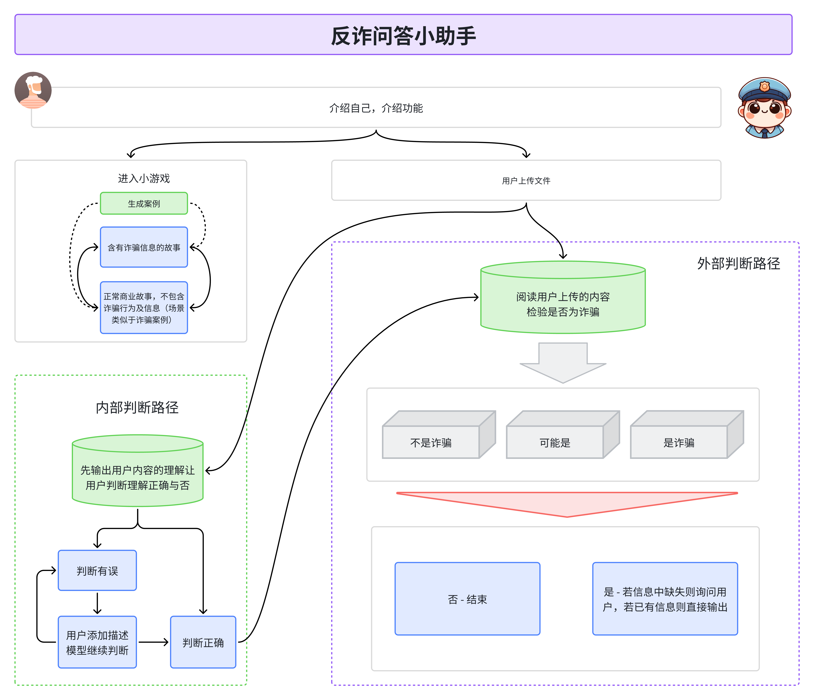

<div align="center">

  <div align="center">
    <b><font size="5">Chat-å诈</font></b>
</div>

[![license][license-image]][license-url]
[![evaluation][evaluation-image]][evaluation-url]

## Chat-å诈模å‹

[OpenXLab](https://openxlab.org.cn/models/detail/Eric-sc/Fanzha1_8B/tree/main) |  [ModelScope](https://www.modelscope.cn/models/EricSC/Fanzha1_8B) | [Github](https://github.com/bobspec/chat-ai-anti-fraud.git)

[license-image]: ./image/license.svg
[evaluation-image]: ./image/compass_support.svg
[license-url]: ./LICENSE
[evaluation-url]: https://github.com/internLM/OpenCompass/
</div>

## ğŸ“目录

- Chat-å诈
  - [ğŸ“目录](#目录)
  - [📖 简介](#简介)
  - [🔗 模å‹åŠä½“验地å€](#模å‹åŠä½“验地å€)
  - [🚀 News](#-news)
  - [🧾 æ•°æ®é›†](#æ•°æ®é›†)
  - [ğŸ› ï¸ ä½¿ç”¨æ–¹æ³•](#使用方法)
    - [快速开始](#快速开始)
    - [é‡æ–°è®­ç»ƒ](#é‡æ–°è®­ç»ƒ)
      - [ç¯å¢ƒæ­å»º](#ç¯å¢ƒæ­å»º)
      - [XTuner微调](#XTuner微调)
    - [部署](#部署)
    - [测评ä¸é‡åŒ–](#测评ä¸é‡åŒ–)
      - [OpneCompass 评测](#OpenCompass评测)
  - [💕 致谢](#致谢)
    - [项目æˆå‘˜](#项目æˆå‘˜)
    - [特别感谢](#特别感谢)

## 简介
Chat-å诈模å‹æ˜¯åˆ©ç”¨å诈相关的数æ®é›†è¿›è¡Œæ¨¡å‹è®­ç»ƒçš„语言模å‹ï¼ŒåŸºäº InternLM2 进行 LoRA 微调得到的诈骗信æ¯è¯†åˆ«åŠåˆ†æ的语言模å‹ã€‚
å诈模å‹çš„å¼€å‘æºäºæˆ‘们观察到é­å—到诈骗的人群越æ¥è¶Šè¶‹å‘äºé’少年，而诈骗手段层出ä¸ç©·ï¼Œå¾ˆå¤šäººå› ç¼ºä¹é˜²èŒƒæ„识和应对技巧，轻易æˆä¸ºè¯ˆéª—分å­çš„目标，蒙å—巨大的财产æŸå¤±å’Œç²¾ç¥ä¼¤å®³ã€‚尽管社会å„ç•Œä¸æ–­åŠ å¼ºå诈æ示和宣传，帮助人们æ高警惕，但ä¾ç„¶æœ‰å¤§é‡äººç¾¤æœªèƒ½åŠæ—¶è¾¨åˆ«å‡ºè¯ˆéª—陷阱。

我们决定利用人工智能技术，开å‘一个智能å诈助手。å诈模å‹é€šè¿‡å­¦ä¹ å¤§é‡çš„诈骗案例和对è¯æ•°æ®ï¼Œèƒ½å¤Ÿåœ¨ç”¨æˆ·ä¸æ½œåœ¨è¯ˆéª—者的对è¯ä¸­å®æ—¶æ供预警和建议，帮助用户迅速识别和应对诈骗行为。我们的目标是将这些智能防范手段普åŠåˆ°æ›´å¤šäººç¾¤ï¼Œå°¤å…¶æ˜¯é‚£äº›ä¸å¤ªäº†è§£ç½‘络安全的用户，ä»è€Œæœ‰æ•ˆå‡å°‘诈骗事件的å‘生。

通过å诈模å‹çš„广泛应用，弥补å诈宣传中的ä¸è¶³ä¹‹å¤„，为æ¯ä¸€ä½ç”¨æˆ·æä¾›24å°æ—¶ä¸é—´æ–­çš„智能防护系统。这个模å‹ä¸ä»…是对ç°æœ‰å诈æªæ–½çš„有力补充，更是利用科技手段æå‡ç¤¾ä¼šæ•´ä½“安全水平的创新å°è¯•ã€‚通过æŒç»­ä¼˜åŒ–å’Œæ¨å¹¿è¿™ä¸€æ¨¡å‹ï¼Œæˆ‘们åšä¿¡èƒ½å¤Ÿä¸ºæ„建一个更安全ã€æ›´å®‰å¿ƒçš„社会贡献一份力é‡ã€‚
本项目å®ç°äº†ä¸€ä¸ªåŸºäºå诈数æ®é›†çš„个性化 AI 微调大模å‹å®Œæ•´æµç¨‹ï¼Œå¸®åŠ©ç”¨æˆ·è¯†åˆ«å’Œåº”对å„ç§ç½‘络诈骗手段。通过分æå„ç§è¯ˆéª—案例和用户的èŠå¤©è®°å½•ï¼ŒChat-å诈模å‹èƒ½å¤Ÿåœ¨ç”¨æˆ·ä¸æ½œåœ¨è¯ˆéª—者的对è¯ä¸­å®æ—¶æ供预警和建议。

具体如何å®ç°å…¨æµç¨‹çš„å诈 AI 微调，å¯å‚考主仓库-[chat-ai-anti-fraud](https://github.com/bobspec/chat-ai-anti-fraud.git)。
如何学习大模å‹éƒ¨ç½²å’Œå¾®è°ƒè¯·å‚考：[å¼€æºå¤§æ¨¡å‹é£Ÿç”¨æŒ‡å—](https://github.com/datawhalechina/self-llm) ä»¥åŠ [书生·浦语大模å‹å®æˆ˜è¥è¯¾ç¨‹](https://github.com/InternLM/tutorial)

Chatå诈模å‹å…¨æµç¨‹å¦‚图所示：



## 模å‹åŠä½“验地å€

### 体验地å€ï¼š

### Chat-åè¯ˆæ¨¡å‹ ä¸‹è½½åœ°å€ï¼š

#### OpenXLab
1.8B:[OpenXLab](https://openxlab.org.cn/models/detail/Eric-sc/Fanzha1_8B/tree/main) 

#### ModelScope
1.8B: [ModelScope](https://www.modelscope.cn/models/EricSC/Fanzha1_8B)

## 🚀 News

***2024å¹´6月21æ—¥ï¼Œå®Œæˆ [InternLM2-chat-1_8B模å‹çš„微调](https://openxlab.org.cn/models/detail/Eric-sc/Fanzha1_8B/tree/main)***

## æ•°æ®é›†

Chat-åè¯ˆæ¨¡å‹ æ•°æ®é›†é‡‡ç”¨å„ç§ç½‘络诈骗案例和用户的èŠå¤©è®°å½•ï¼Œå…±è®¡ 3000 ä½™æ¡,ä½äºdatasets文件夹下.æ•°æ®é›†æ ·ä¾‹ï¼š
```
{
        "conversation": [
            {
                "input": "我æ¥åˆ°äº†ä¸€ä¸ªè‡ªç§°æ˜¯ç”µä¿¡å…¬å¸çš„电è¯ï¼Œå‘Šè¯‰æˆ‘我的电è¯è´¹æ¬ è´¹ï¼Œè¦æ±‚我立å³é€šè¿‡ä»–们æ供的链æ¥è¿›è¡Œæ”¯ä»˜ï¼Œå¦åˆ™ä¼šæœ‰æ»çº³é‡‘并且åœæœºã€‚我按照他们的指示进行了æ“作，åæ¥å‘ç°ç”µè¯è´¹å¹¶æ²¡æœ‰æ¬ è´¹ï¼Œè¿™æ˜¯ä¸æ˜¯è¯ˆéª—？",
                "output": "è¿™ç§æƒ…况å±äºå…¸å‹çš„电信诈骗。骗å­é€šå¸¸ä¼šå†’充电信公å¸ï¼Œå£°ç§°ä½ æ¬ è´¹ï¼Œæ供一个虚å‡çš„链æ¥æˆ–电è¯å·ç è®©ä½ æ”¯ä»˜æ‰€è°“的欠款。判断这类诈骗的关键点包括：1. 自称是官方的电è¯ï¼Œä½†è¦æ±‚你通过é官方渠é“支付费用；2. æ供紧急的时间é™åˆ¶ï¼Œåˆ¶é€ ç´§è¿«æ„Ÿï¼›3. è¦æ±‚æ供个人信æ¯æˆ–支付信æ¯ã€‚é‡åˆ°è¿™ç§æƒ…况，应立å³æŒ‚断电è¯ï¼Œé€šè¿‡å®˜æ–¹æ¸ é“æ ¸å®ä¿¡æ¯ï¼Œé¿å…通过陌生链æ¥æˆ–电è¯è¿›è¡Œæ”¯ä»˜ã€‚"
            }
        ]
    },
    {
        "conversation": [
            {
                "input": "我收到了一æ¡çŸ­ä¿¡ï¼Œè¯´æˆ‘的快递丢失了，需è¦æˆ‘点击一个链æ¥è¿›è¡Œèµ”å¿ç”³è¯·ã€‚我点击链æ¥å¹¶å¡«å†™äº†ä¸ªäººä¿¡æ¯ï¼Œåæ¥å‘ç°å¿«é€’并没有丢失，这是ä¸æ˜¯è¯ˆéª—？",
                "output": "è¿™ç§æƒ…况å±äºå…¸å‹çš„快递诈骗。骗å­é€šè¿‡å‘é€è™šå‡çš„快递丢失短信，引导你点击钓鱼链æ¥å¹¶å¡«å†™ä¸ªäººä¿¡æ¯ã€‚判断这类诈骗的关键点包括：1. 未通过官方渠é“通知快递问题；2. æ供的链æ¥ä¸ºé官方链æ¥ï¼›3. è¦æ±‚填写个人信æ¯æˆ–支付费用。é‡åˆ°è¿™ç§æƒ…况，应立å³è”系快递公å¸å®˜æ–¹å®¢æœç¡®è®¤æƒ…况，é¿å…通过陌生链æ¥æ“作。"
            }
        ]
    }
```


## 使用方法
### 快速开始
#### 1ã€ä¸‹è½½æ¨¡å‹

#### 安装modelscope库
```
pip install modelscope
```

#### 模å‹ä¸‹è½½
```
# 设置日志级别
from modelscope.hub.snapshot_download import snapshot_download
logging.basicConfig(level=logging.DEBUG)
try:
    logging.debug("Starting model download...")
    model_dir = snapshot_download('EricSC/Fanzha1_8B', revision='v1.0.0')
    logging.debug(f"Model downloaded to {model_dir}")
except Exception as e:
    logging.error(f"Error during model download: {e}")
    st.error(f"Error during model download: {e}")
    model_dir = None
```
#### 本地部署
```
git clone https://github.com/bobspec/chat-ai-anti-fraud.git
python start.py
```

### é‡æ–°è®­ç»ƒ

#### ç¯å¢ƒæ­å»º
##### clone 本项目
```
git clone https://github.com/xiangboit/chat-ai-anti-fraud.git
cd chat-ai-anti-fraud
```
##### 创建ç¯å¢ƒ
```
pip install -r requirements.txt
cd train/
```
##### 下载模å‹
```
python model_download.py
```
##### XTuner微调
相关路径因æœåŠ¡å™¨ä¸åŒè¯·è‡ªè¡Œå˜æ›´è·¯å¾„，
使用 XTuner 进行微调，具体脚本å¯å‚考internlm2_chat_7b_qlora_oasst1_e3_copy.py，该脚本在train文件夹下。脚本内有较为详细的注释。
```
pip install xtuner
cd ./chat-ai-anti-fraud/train
xtuner train ./internlm2_chat_7b_qlora_oasst1_e3_copy.py --work-dir ./xtmodel
pip install --upgrade pandas
xtuner train ./internlm2_chat_7b_qlora_oasst1_e3_copy.py --work-dir ./xtmodel
mkdir huggingface
xtuner convert pth_to_hf ./xtmodel/internlm2_chat_7b_qlora_oasst1_e3_copy.py ./xtmodel/epoch_3.pth ./huggingface/
xtuner convert merge ./Shanghai_AI_Laboratory/internlm2-chat-1_8b/ ./huggingface/ ./fan_model
```
##### 测试
```
xtuner chat ./fan_model/ --prompt-template internlm2_chat
```
##### 模å‹æ‰“包下载
```
tar -zcvf fan_model.targz fan_model/
```

### 部署
购买具有GPUçš„æœåŠ¡å™¨,è¿è¡Œä»¥ä¸‹ç¨‹åº
```
git clone https://github.com/bobspec/chat-ai-anti-fraud.git
python start.py
```

### 测评ä¸é‡åŒ–
### OpenCompass评测
#### 安装 OpenCompass
```
git clone https://github.com/open-compass/opencompass
cd opencompass
pip install -e .
```
#### 下载解å‹æ•°æ®é›†
```
cp /share/temp/datasets/OpenCompassData-core-20231110.zip /root/opencompass/
unzip OpenCompassData-core-20231110.zip
```
#### 评测å¯åŠ¨ï¼
##### 评测åŸå§‹æ¨¡å‹
```
python run.py --datasets ceval_gen --hf-path /chat-ai-anti-fraud/train/Shanghai_AI_Laboratory/internlm2-chat-1_8b --tokenizer-path /chat-ai-anti-fraud/train/Shanghai_AI_Laboratory/internlm2-chat-1_8b --tokenizer-kwargs padding_side='left' truncation='left' trust_remote_code=True --model-kwargs trust_remote_code=True device_map='auto' --max-seq-len 1024 --max-out-len 16 --batch-size 2 --num-gpus 1 --debug
```
##### 评测微调å模å‹
```
python run.py --datasets ceval_gen --hf-path /chat-ai-anti-fraud/train/fan_model --tokenizer-path /chat-ai-anti-fraud/train/fan_model --tokenizer-kwargs padding_side='left' truncation='left' trust_remote_code=True --model-kwargs trust_remote_code=True device_map='auto' --max-seq-len 1024 --max-out-len 16 --batch-size 2 --num-gpus 1 --debug
```

## 致谢

### 项目æˆå‘˜
* Bobo - 项目负责人 （负责项目规划，模å‹è®­ç»ƒã€æ¨¡å‹è¯„测）
* 云天空（负责数æ®é›†æ”¶é›†ï¼Œæ¨¡å‹è®­ç»ƒã€æ¨¡å‹è¯„测）
* Dayises （负责数æ®é›†æ”¶é›†ï¼‰
* 施诚（负责数æ®é›†æ”¶é›†ï¼‰
